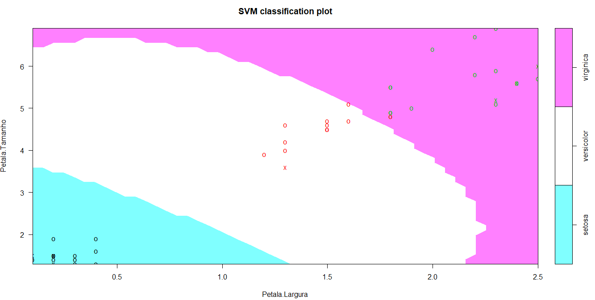

# Introdução à Machine Learning - Itaú
Demonstração que fiz na palestra que fiz no Itaú - Introdução à Machine Learning. 

## Dataset
Para realizar a demonstração, utilizei o dataset Iris (https://archive.ics.uci.edu/ml/datasets/iris): 

# Algoritmos e Resultados
Foi utilizado o algoritmo **k-means** para demonstrar o conceito dos algoritmos de Aprendizado de Máquina Não Supervisionado. 

E o resultado: 

Para demostrar os conceitos dos algoritmos de Aprendizado de Máquina Supervisionado, utilizei uma **Rede Neural** e um **SVM** (_Support Vector Machines_). Tive os resultados: 

**Rede Neural**: 

**SVN**:

